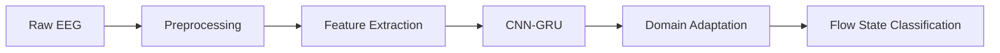

# EEG Flow State Mermaid Diagrams

TODO: Add your full mermaid diagrams here.

Starter pipeline:

```mermaid
graph LR
  A[Raw EEG] --> B[Preprocessing]
  B --> C[Feature Extraction]
  C --> D[CNN-GRU]
  D --> E[Domain Adaptation]
  E --> F[Flow State Classification]
```
